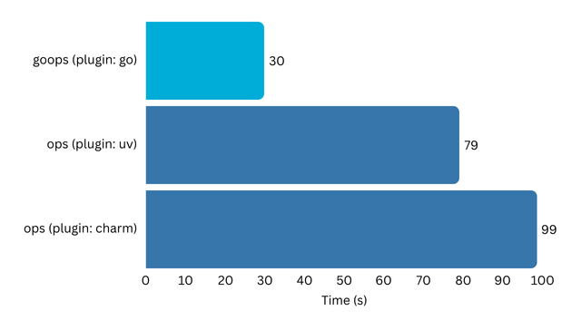

# goops

**Develop Reliable, Portable, and Fast Juju Charms in Go**

`goops` is a Go library for developing robust Juju charms. While charm developers traditionally use the [ops Python framework](https://github.com/canonical/operator), Python's dynamic typing and interpreter-based execution often lead to runtime errors and portability issues across different bases. In contrast, Go compiles to a single, self-contained binary, ensuring greater reliability and consistent behavior in any environment.

Building a charm with `goops` is 2-3 times faster.

<p align="center">
  
</p>

<p align="center">
  <i>Running charmcraft pack for an X.509 certificates provider charm from a clean cache.</i>
</p>


## Getting Started

### 1. Use the Charmcraft `go` plugin

Use the `go` plugin to build your charm in `charmcraft.yaml`:

```yaml
parts:
  charm:
    source: .
    plugin: go
    build-snaps:
      - go
    organize:
      bin/<your-charm-name>: dispatch
```

### 2. Write your charm

Create a `main.go` file under the `cmd/<your-charm-name>/` directory in your charm's root directory. This file will contain the main logic of your charm. Import the `goops` library and use its functions to interact with Juju. For example:

```go
package main

import (
	"os"

	"github.com/gruyaume/goops"
	"github.com/gruyaume/goops/commands"
)

func main() {
	hookContext := goops.NewHookContext()
	hookName := hookContext.Environment.JujuHookName()
	hookContext.Commands.JujuLog(commands.Info, "Hook name:", hookName)

	statusOpts := &commands.StatusOptions{
		Name:    commands.StatusActive,
		Message: "A happy charm",
	}

	err := hookContext.Commands.StatusSet(statusOpts)
	if err != nil {
		hookContext.Commands.JujuLog(commands.Error, "Could not set status:", err.Error())
		os.Exit(0)
	}

	hookContext.Commands.JujuLog(commands.Info, "Status set to active")
	os.Exit(0)
}
```

The [certificates charm repository](https://github.com/gruyaume/certificates-operator) provides an example of the library's use.

## Reference

### Design principles

- **Reliability**: Our top priority is building predictable and robust charms.
- **Simplicity**: `goops` serves as a minimal, one-to-one mapping between Juju concepts and Go constructs. It is not a framework; it does not impose charm design patterns. The library has no dependencies.

### Juju compatibility

`goops` is compatible with Juju 3.6 and later.
