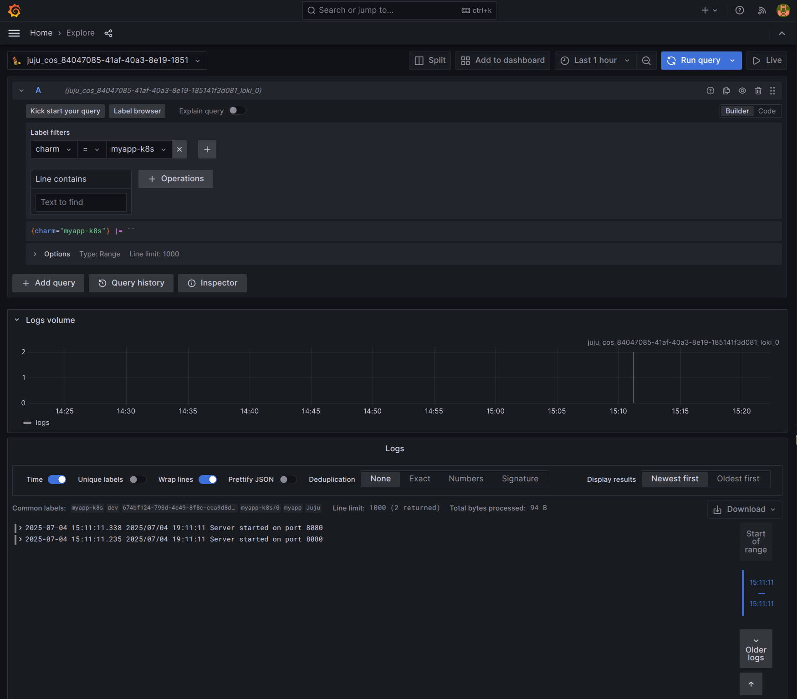

# 3. Integrate with Loki

In this section, we will integrate the `myapp` charm charm with Loki to send workload logs. This step of the tutorial assumes you have completed the previous step.

## 3.1 Update the Go charm

Open the `internal/charm/charm.go` file, instantiate a Logging object from the `charm-libraries` package and enable the logging endpoint. Here's the updated code:

```go
package charm

import (
	"bytes"
	"fmt"
	"strings"

	"github.com/canonical/pebble/client"
	"github.com/gruyaume/charm-libraries/logging"
	"github.com/gruyaume/goops"
	"gopkg.in/yaml.v3"
)

const (
	ConfigPath             = "/etc/myapp/config.yaml"
	LoggingIntegrationName = "logging"
	ServiceName            = "myapp"
	ContainerName          = "myapp"
)

type ServiceConfig struct {
	Override string `yaml:"override"`
	Summary  string `yaml:"summary"`
	Command  string `yaml:"command"`
	Startup  string `yaml:"startup"`
}

type PebbleLayer struct {
	Summary     string                   `yaml:"summary"`
	Description string                   `yaml:"description"`
	Services    map[string]ServiceConfig `yaml:"services"`
}

type PebblePlan struct {
	Services map[string]ServiceConfig `yaml:"services"`
}

type JujuConfig struct {
	Port int `json:"port"`
}

func Configure() error {
	c := JujuConfig{}

	err := goops.GetConfig(&c)
	if err != nil {
		return fmt.Errorf("could not get config: %w", err)
	}

	if c.Port < 1 || c.Port > 65535 {
		_ = goops.SetUnitStatus(goops.StatusBlocked, "invalid config: port must be between 1 and 65535")
		return nil
	}

	err = goops.SetPorts([]*goops.Port{
		{Port: c.Port, Protocol: goops.ProtocolTCP},
	})
	if err != nil {
		return fmt.Errorf("could not set ports: %w", err)
	}

	pebble := goops.Pebble(ContainerName)

	_, err = pebble.SysInfo()
	if err != nil {
		_ = goops.SetUnitStatus(goops.StatusWaiting, "waiting for pebble to be ready")
		return nil
	}

	configFileChanged, err := syncConfig(pebble, c.Port)
	if err != nil {
		return fmt.Errorf("could not sync config: %w", err)
	}

	err = syncPebbleService(pebble)
	if err != nil {
		return fmt.Errorf("could not sync pebble service: %w", err)
	}

	if configFileChanged {
		_, err = pebble.Restart(
			&client.ServiceOptions{
				Names: []string{ServiceName},
			},
		)
		if err != nil {
			return fmt.Errorf("could not start pebble service: %w", err)
		}

		goops.LogInfof("Pebble service restarted")
	}

	i := &logging.Integration{
		RelationName:  LoggingIntegrationName,
		ContainerName: ContainerName,
	}

	err = i.EnableEndpoints()
	if err != nil {
		goops.LogDebugf("Could not enable logging endpoints: %v", err)
	}

	_ = goops.SetUnitStatus(goops.StatusActive, "service is running on port", fmt.Sprintf("%d", c.Port))

	return nil
}

type MyAppConfig struct {
	Port int `yaml:"port"`
}

func getExpectedConfig(port int) ([]byte, error) {
	c := MyAppConfig{
		Port: port,
	}

	b, err := yaml.Marshal(c)
	if err != nil {
		return nil, fmt.Errorf("could not marshal config to YAML: %w", err)
	}

	return b, nil
}

func syncConfig(pebble goops.PebbleClient, port int) (bool, error) {
	expectedContent, err := getExpectedConfig(port)
	if err != nil {
		return false, fmt.Errorf("could not get expected config: %w", err)
	}

	target := &bytes.Buffer{}

	err = pebble.Pull(&client.PullOptions{
		Path:   ConfigPath,
		Target: target,
	})
	if err != nil {
		goops.LogInfof("could not pull existing config from pebble: %v", err)
	}

	if target.String() == string(expectedContent) {
		goops.LogInfof("Config file is already up to date at %s", ConfigPath)
		return false, nil
	}

	err = pebble.Push(&client.PushOptions{
		Source: strings.NewReader(string(expectedContent)),
		Path:   ConfigPath,
	})
	if err != nil {
		return false, fmt.Errorf("could not push config to pebble: %w", err)
	}

	goops.LogInfof("Config file pushed to %s", ConfigPath)

	return true, nil
}

func syncPebbleService(pebble goops.PebbleClient) error {
	err := addPebbleLayer(pebble)
	if err != nil {
		return fmt.Errorf("could not add pebble layer: %w", err)
	}

	goops.LogInfof("Pebble layer created")

	_, err = pebble.Start(&client.ServiceOptions{
		Names: []string{ServiceName},
	})
	if err != nil {
		return fmt.Errorf("could not start pebble service: %w", err)
	}

	goops.LogInfof("Pebble service started")

	return nil
}

func addPebbleLayer(pebble goops.PebbleClient) error {
	layerData, err := yaml.Marshal(PebbleLayer{
		Summary:     "MyApp layer",
		Description: "pebble config layer for MyApp",
		Services: map[string]ServiceConfig{
			ServiceName: {
				Override: "replace",
				Summary:  "My App Service",
				Command:  "myapp -config " + ConfigPath,
				Startup:  "enabled",
			},
		},
	})
	if err != nil {
		return fmt.Errorf("could not marshal layer data to YAML: %w", err)
	}

	err = pebble.AddLayer(&client.AddLayerOptions{
		Combine:   true,
		Label:     "myapp",
		LayerData: layerData,
	})
	if err != nil {
		return fmt.Errorf("could not add pebble layer: %w", err)
	}

	return nil
}
```

Install the go dependencies:

```bash
go mod tidy
```

## 3.2 Update the charm definition

Add a requires section to the `charmcraft.yaml` file:

```yaml
...
requires:
  logging:
    interface: loki_push_api
    limit: 1
```

## 3.3 Build the charm

Build the charm:

```bash
charmcraft pack --verbose
```


## 3.4 Deploy the charm

Deploy the charm to your Kubernetes cluster:

```bash
juju deploy ./myapp-k8s_amd64.charm --resource myapp-image=ghcr.io/gruyaume/myapp:latest
```

## 3.5 Deploy COS Lite

Create a new Juju model for Canonical Observability Stack (COS):

```bash
juju add-model cos
```

Deploy the COS Lite bundle:

```bash
juju deploy cos-lite
```

Create an integration offer for Loki:

```bash
juju offer cos.loki:logging
```

Retrieve the Grafana admin password:

```bash
juju run grafana/leader get-admin-password
```

You should see output similar to this:

```bash
guillaume@courge:~$ juju run grafana/leader get-admin-password
Running operation 13 with 1 task
  - task 14 on unit-grafana-0

Waiting for task 14...
admin-password: NwrZneKKBZLn
url: http://10.0.0.3/cos-grafana
```

Navigate to the Grafana URL in your web browser, login with the `admin` username and the password returned by the action.

## 3.6 Integrate `myapp-k8s` with `loki-k8s`

Switch back to the `demo` model:

```bash
juju switch demo
```

Consume the Loki integration offer:

```bash
juju consume cos.loki
```

Integrate `myapp-k8s` with `loki-k8s`:

```bash
juju integrate myapp-k8s:logging loki:logging
```

## 3.7 Visualize the logs in Grafana

Navigate Grafana in your web browser, click on the `Explore` icon in the left sidebar, click on the `Loki` data source, and enter the following query: `{charm="myapp-k8s"}`. You should see the logs from your `myapp-k8s` charm, specifically `Server started on port 8080`.

{ align=center }
